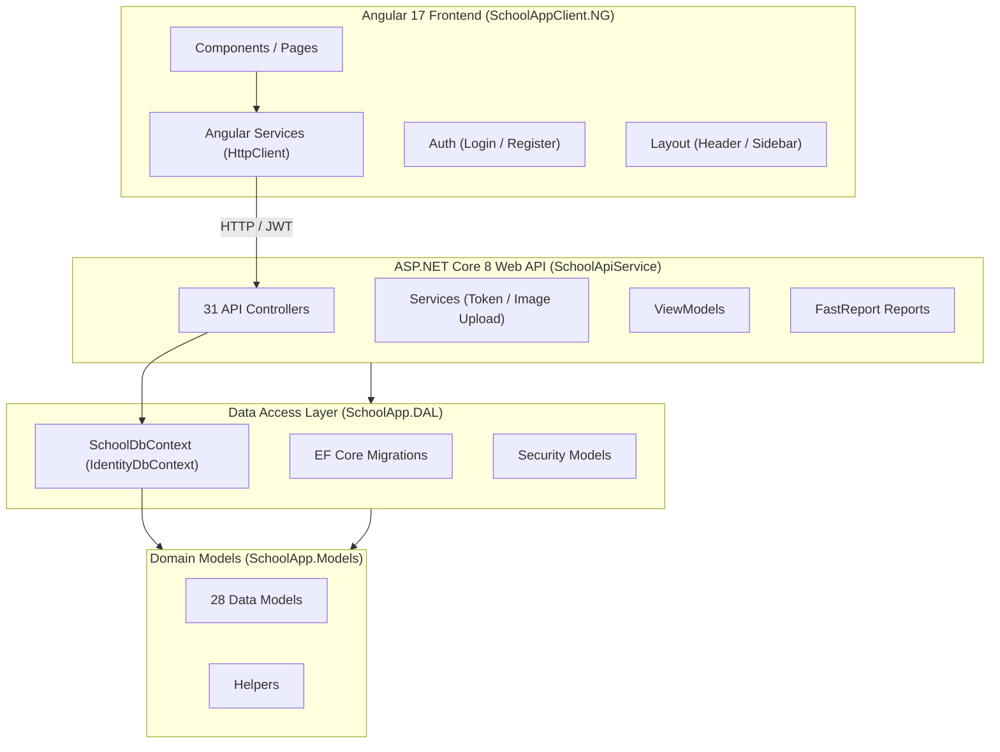
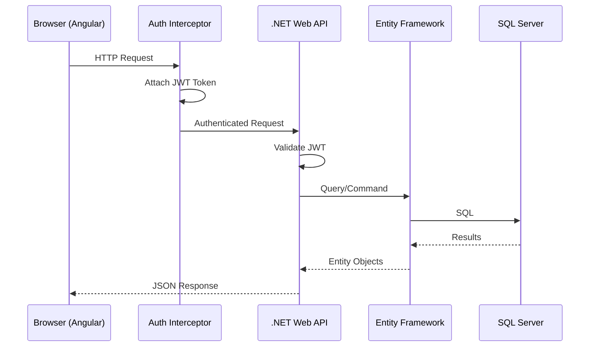
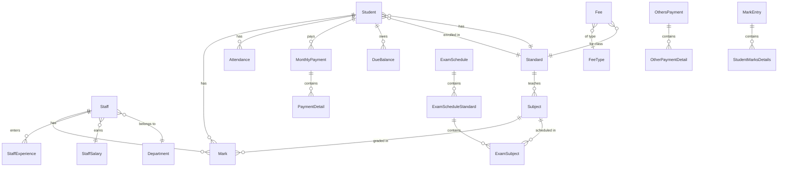

# School Management System — Full Project Analysis

## Overview

A comprehensive **School Management System** built with a **.NET 8 Web API** backend and an **Angular 17** frontend. The solution follows a 3-tier architecture with clear separation of concerns across 4 projects.

---

## Solution Architecture

---

## Project Structure

### 1. **SchoolApp.Models** — Domain / Entity Layer
> [SchoolApp.Models.csproj](file:///e:/projects/SchoolManagementSystem-master/SchoolManagementSystem-master/SchoolApp.Models/SchoolApp.Models.csproj)

| Category | Files | Description |
|----------|-------|-------------|
| **Core Entities** | `Student.cs`, `Staff.cs`, `Subject.cs`, `Standard.cs`, `Department.cs` | Primary school domain objects |
| **Attendance** | `Attendance.cs`, `StudentAttendance.cs`, `StaffAttendance.cs` | Attendance tracking models |
| **Exam System** | `ExamType.cs`, `ExamSchedule.cs`, `ExamScheduleStandard.cs`, `ExamSubject.cs` | Full exam management hierarchy |
| **Marks** | `Mark.cs`, `MarkNew.cs`, `MarkEntry.cs`, `StudentMarksDetails.cs` | Grading and mark entry system |
| **Financial** | `Fee.cs`, `FeeType.cs`, `MonthlyPayment.cs`, `OthersPayment.cs`, `PaymentDetail.cs`, `OtherPaymentDetail.cs`, `PaymentMonth.cs`, `DueBalance.cs` | Complete fee & payment management |
| **Staff HR** | `StaffExperience.cs`, `StaffSalary.cs` | Staff experience and salary tracking |
| **Academic** | `AcademicMonth.cs`, `AcademicYear.cs` | Academic calendar models |

> [!NOTE]
> Some models are excluded from compilation via `.csproj`: `MarkEntry.cs`, `StaffAttendance.cs`, `StudentAttendance.cs` — indicating they were replaced or refactored.

---

### 2. **SchoolApp.DAL** — Data Access Layer
> [SchoolApp.DAL.csproj](file:///e:/projects/SchoolManagementSystem-master/SchoolManagementSystem-master/SchoolApp.DAL/SchoolApp.DAL.csproj)

| Component | File | Description |
|-----------|------|-------------|
| **DbContext** | [SchoolDbContext.cs](file:///e:/projects/SchoolManagementSystem-master/SchoolManagementSystem-master/SchoolApp.DAL/SchoolContext/SchoolDbContext.cs) | 1,513 lines — inherits `IdentityDbContext<ApplicationUser>`. Contains 30+ DbSets, Fluent API config, and extensive seed data |
| **Factory** | [DbContextFactory.cs](file:///e:/projects/SchoolManagementSystem-master/SchoolManagementSystem-master/SchoolApp.DAL/SchoolContext/DbContextFactory.cs) | Design-time factory for migrations |
| **Migrations** | `Mig1` + `first-project-running` | 2 migrations applied |
| **Security** | `ApplicationUser.cs`, `AuthRequest.cs`, `AuthResponse.cs`, `RegistrationRequest.cs` | ASP.NET Identity + JWT auth models |
| **Database** | `SchoolSystemDb.mdf` + `.ldf` | Embedded LocalDB database (8 MB each) |

**Key DbContext Features:**
- Computed column for `StaffSalary.NetSalary` (auto-calculated from salary components)
- Composite key on `StudentMarksDetails` (`StudentId` + `MarkEntryId`)
- Unique indexes on `Subject.SubjectCode`, `Student.UniqueStudentAttendanceNumber`, `Staff.UniqueStaffAttendanceNumber`
- Extensive seed data: Departments (8), ExamTypes (5), FeeTypes (6), Standards (10), ExamSchedules (3), Subjects (10+), Academic Years (2000–2050)

---

### 3. **SchoolApiService** — Web API Layer
> [SchoolApiService.csproj](file:///e:/projects/SchoolManagementSystem-master/SchoolManagementSystem-master/SchoolApiService/SchoolApiService.csproj)

#### Controllers (31 files — 8 excluded from compilation)

| Module | Active Controllers | Key Endpoints |
|--------|-------------------|---------------|
| **Auth** | `AccountController` | Login, Register |
| **Students** | `StudentsController` | CRUD for students |
| **Staff** | `StaffsController`, `StaffExperiencesController`, `StaffSalariesController` | Staff management, experience, salaries |
| **Attendance** | `AttendancesController` | Student/staff attendance |
| **Exams** | `ExamTypesController`, `ExamSchedulesController`, `ExamScheduleStandardsController` | Full exam lifecycle |
| **Marks** | `MarksController`, `MarkEntryController` | Mark entry and grading |
| **Finance** | `FeesController`, `FeeTypesController`, `MonthlyPaymentsController`, `OthersPaymentsController`, `DueBalancesController` | Payment & fee management |
| **Academic** | `StandardsController`, `SubjectsController`, `DepartmentsController`, `AcademicMonthsController` | School structure |
| **Utility** | `CommonController`, `WebReportsController` | Shared lookups, FastReport reports |

> [!IMPORTANT]
> **Excluded controllers** (present but not compiled): `EmployeesController`, `EmployeeTypesController`, `ExamSubjectsController`, `FeePaymentsController`, `FeeStructuresController`, `MarkEntriesController`, `StaffAttendancesController`, `StudentAttendancesController`

#### Services
| Service | Purpose |
|---------|---------|
| [TokenService.cs](file:///e:/projects/SchoolManagementSystem-master/SchoolManagementSystem-master/SchoolApiService/Services/TokenService.cs) | JWT token generation and validation |
| [ImageUploadService.cs](file:///e:/projects/SchoolManagementSystem-master/SchoolManagementSystem-master/SchoolApiService/Services/ImageUploadService.cs) | File upload handling to `wwwroot/Upload/` |

#### Configuration ([Program.cs](file:///e:/projects/SchoolManagementSystem-master/SchoolManagementSystem-master/SchoolApiService/Program.cs))
- **Database**: SQL Server via `LocalDbConnection` connection string
- **Auth**: JWT Bearer with `ValidIssuer`, `ValidAudience`, `SymmetricSecurityKey`
- **Identity**: ASP.NET Identity with relaxed password policies (min 4 chars, no special requirements)
- **CORS**: Wide open (`AllowAnyHeader`, `AllowAnyMethod`, `AllowAnyOrigin`)
- **Serialization**: `ReferenceHandler.IgnoreCycles`, `JsonStringEnumConverter`
- **Reporting**: FastReport with MSSQL data connection
- **Swagger**: Configured with JWT Bearer security definition

#### NuGet Packages
| Package | Version |
|---------|---------|
| `Microsoft.AspNetCore.Authentication.JwtBearer` | 8.0.1 |
| `Microsoft.EntityFrameworkCore.Tools` | 8.0.4 |
| `FastReport.OpenSource` + Web + PDF + MsSql | 2024.2.1 |
| `Swashbuckle.AspNetCore` | 6.4.0 |

---

### 4. **SchoolAppClient.NG** — Angular 17 Frontend
> [package.json](file:///e:/projects/SchoolManagementSystem-master/SchoolManagementSystem-master/SchoolAppClient.NG/package.json)

#### Module Structure ([app.module.ts](file:///e:/projects/SchoolManagementSystem-master/SchoolManagementSystem-master/SchoolAppClient.NG/src/app/app.module.ts))
- **Architecture**: NgModule-based (not standalone components)
- **62+ declared components** in a single `AppModule`

#### Components (21 feature folders)

| Feature | Components | Description |
|---------|-----------|-------------|
| **Dashboard** | `dashboard-grid` | Data visualization with Syncfusion Charts |
| **Homepage** | `homepage` | Landing page |
| **Student** | `student-list`, `student-add`, `student-edit`, `student-details` | Full student CRUD |
| **Staff** | `staff-list`, `staff-create`, `staff-edit`, `staff-details`, `staff-delete` | Staff management |
| **Attendance** | `attendance-list`, `attendance-add` | Attendance tracking |
| **Marks** | `marks-list`, `marks-add`, `marks-edit`, `marks-delete` | Legacy marks system |
| **Marks New** | `marksnew-entry-list`, `marksnew-entry-create`, `marksnew-entry-details`, `marksnew-entry-delete` | Refactored marks system |
| **Exam Schedule** | `examschedule-list`, `examschedule-add`, `examschedule-edit` | Exam scheduling |
| **Exam Schedule Standards** | `exam-schedule-standards-list`, `exam-schedule-standards-create`, `exam-schedule-standards-edit` | Standards per schedule |
| **Exam Type** | `examtype-list`, `examtype-add`, `examtype-edit` | Exam type management |
| **Fee** | `fee-list`, `fee-create`, `fee-edit` | Fee management |
| **Fee Type** | `feetype-list`, `feetype-create`, `feetype-edit` | Fee type management |
| **Monthly Payment** | `monthlypayment-list`, `monthlypayment-create`, `monthlypayment-edit`, `monthlypayment-details` | Monthly fee payments |
| **Other Payment** | `other-payment-list`, `other-payment-create`, `other-payment-edit`, `other-payment-details` | Miscellaneous payments |
| **Payment Details** | `payment-details-per-student` | Per-student payment view |
| **Standard** | `standard-list`, `standard-create`, `standard-edit` | Class/grade management |
| **Subject** | `subject-list`, `subject-add`, `subject-edit` | Subject CRUD |
| **Department** | `department-list`, `department-create`, `department-edit` | Department management |
| **Staff Salary** | `staff-salary-list`, `staff-salary-create`, `staff-salary-edit` | Salary management |
| **Confirmation Dialog** | `confirmation-dialog` | Reusable confirm modal |
| **Main** | `main` | Main layout wrapper |

#### Layout Components
| Component | Purpose |
|-----------|---------|
| `HeaderComponent` | Top navigation bar |
| `SidebarComponent` | Side navigation menu |

#### Angular Services (18 services)
Each maps to a corresponding API controller for HTTP operations.

#### Authentication System
| File | Purpose |
|------|---------|
| [auth.service.ts](file:///e:/projects/SchoolManagementSystem-master/SchoolManagementSystem-master/SchoolAppClient.NG/src/app/Authentication/SecurityModels/auth.service.ts) | Login, register, token storage |
| [auth.guard.ts](file:///e:/projects/SchoolManagementSystem-master/SchoolManagementSystem-master/SchoolAppClient.NG/src/app/Authentication/SecurityModels/auth.guard.ts) | Route protection |
| [auth.interceptor.ts](file:///e:/projects/SchoolManagementSystem-master/SchoolManagementSystem-master/SchoolAppClient.NG/src/app/Authentication/SecurityModels/auth.interceptor.ts) | JWT token injection into HTTP requests |
| `LoginComponent` | Login form UI |
| `RegistrationComponent` | Registration form UI |

#### Routing ([app-routing.module.ts](file:///e:/projects/SchoolManagementSystem-master/SchoolManagementSystem-master/SchoolAppClient.NG/src/app/app-routing.module.ts))
- **50+ routes** defined
- Default route redirects to `/home`
- `AuthGuard` applied selectively (only on `examType/edit/:id`)
- Most routes are **unprotected** (guards commented out)

#### UI Libraries
| Library | Purpose |
|---------|---------|
| **Syncfusion EJ2** | Grids, Charts, Buttons, Inputs, PDF Viewer, Popups, Notifications |
| **Angular Material 17** | Sidenav, Toolbar, Menu, Icons, Cards, Tables, Lists, Buttons |
| **Bootstrap 5.3** | Base CSS framework |
| **Font Awesome** | Icons |
| **jwt-decode** | Client-side JWT parsing |

---

## Data Flow Architecture

---

## Database Schema (Key Entities & Relationships)

---

## Technology Summary

| Layer | Technology | Version |
|-------|-----------|---------|
| **Backend Runtime** | .NET | 8.0 |
| **Web Framework** | ASP.NET Core Web API | 8.0 |
| **ORM** | Entity Framework Core | 8.0.1 / 8.0.4 |
| **Database** | SQL Server (LocalDB/Express) | 2022 |
| **Auth** | ASP.NET Identity + JWT Bearer | 8.0.1 |
| **Reporting** | FastReport Open Source | 2024.2.1 |
| **API Docs** | Swagger / Swashbuckle | 6.4.0 |
| **Frontend Framework** | Angular | 17.2+ |
| **UI Components** | Syncfusion EJ2 Angular | Latest |
| **Material Design** | Angular Material | 17.3.6 |
| **CSS Framework** | Bootstrap | 5.3.3 |
| **Icons** | Font Awesome + Material Icons | Latest |
| **Language** | TypeScript | 5.3.2 |

---

## Key Observations

> [!TIP]
> **Strengths:**
> - Clear 3-tier separation (Models → DAL → API → Client)
> - Comprehensive domain coverage (attendance, exams, marks, payments, staff, students)
> - JWT auth implemented end-to-end (API + Angular interceptor + guard)
> - Rich UI library stack (Syncfusion grids/charts + Angular Material layout)
> - Seed data for quick bootstrapping
> - FastReport integration for server-side reporting

> [!WARNING]
> **Areas for improvement:**
> - **Large monolithic modules**: `AppModule` has 62+ component declarations — could benefit from feature modules / lazy loading
> - **Auth guards mostly disabled**: Only 1 of 50+ routes has `canActivate: [AuthGuard]`
> - **Wide-open CORS**: `AllowAnyOrigin` in production is a security risk
> - **Connection strings in source**: Hardcoded server names and JWT secrets in `appsettings.json`
> - **Excluded but present files**: 8+ controllers and 3+ models are excluded from compilation but still in the repo — cleanup recommended
> - **No repository/unit-of-work pattern**: Controllers query `DbContext` directly
> - **No lazy loading in Angular routing**: All components loaded upfront
> - **Duplicate route definitions**: `departments` path defined twice in routing
> - **Inconsistent naming**: Mix of `PascalCase` and `camelCase` in DbSet names
